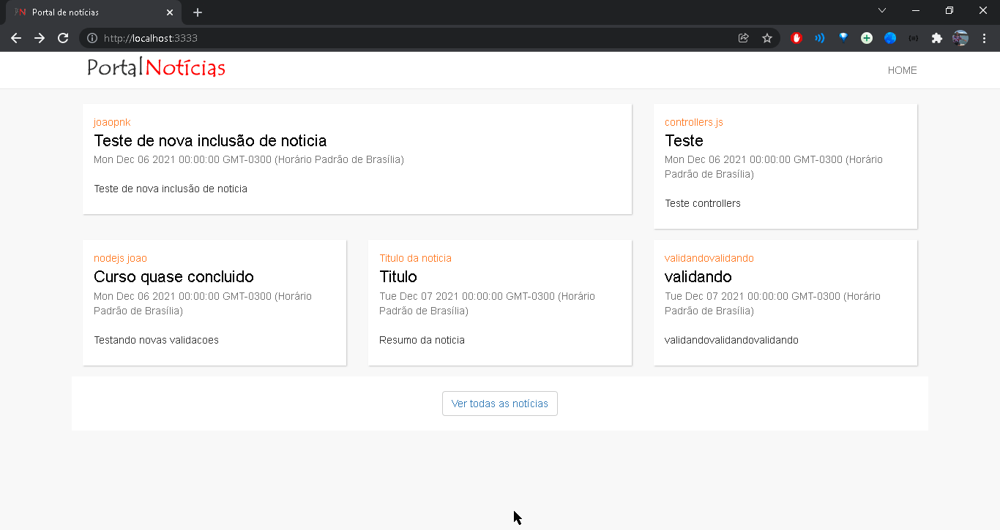
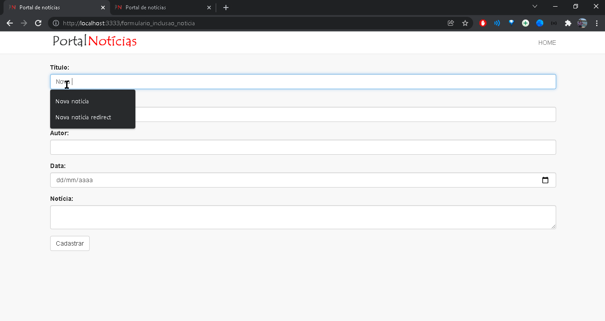

## [NODEJS] Portal_de_noticias

[PT-BR]💻 Portal de noticias desenvolvido para conclusão do curso de nodejs

<h3>🚀 Tecnologias utilizadas </h3>
<ul>
  <li> NodeJs </li>
  <li> MySql </li>
  <li> Bootstrap </li>
  <li> Javascript </li>
</ul> 

[ ENG ]💻 News portal developed to complete the nodejs course

<h3>🚀 Technologies used </h3>
<ul>
  <li> NodeJs </li>
  <li> MySql </li>
  <li> Bootstrap </li>
  <li> Javascript </li>
</ul> 

👨‍💻 Preview: 

 

